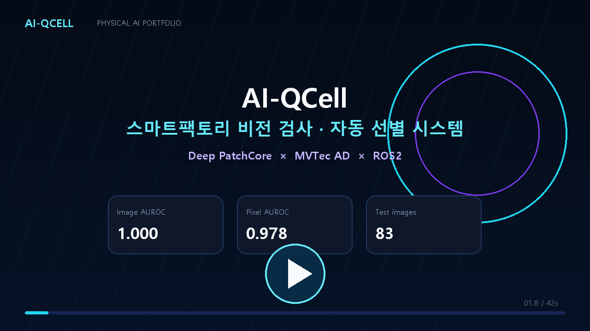
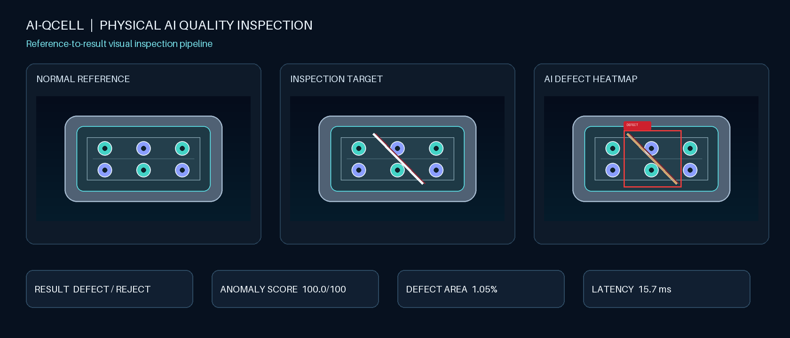
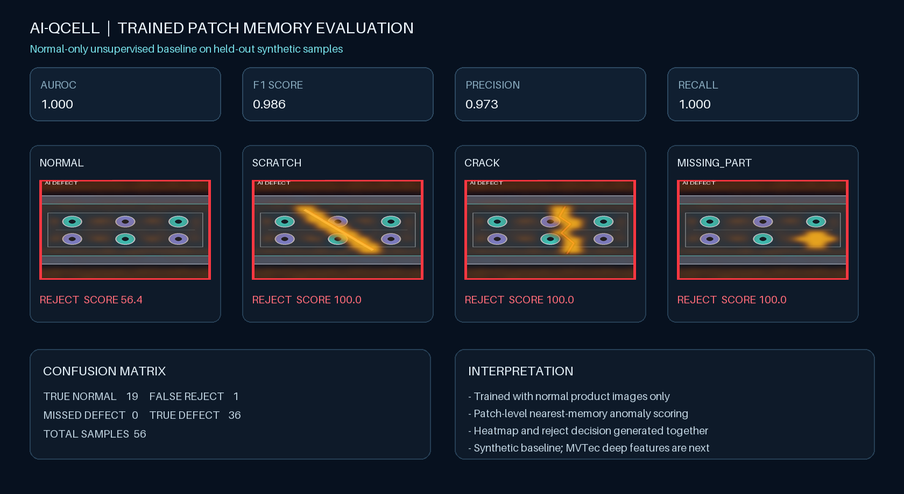
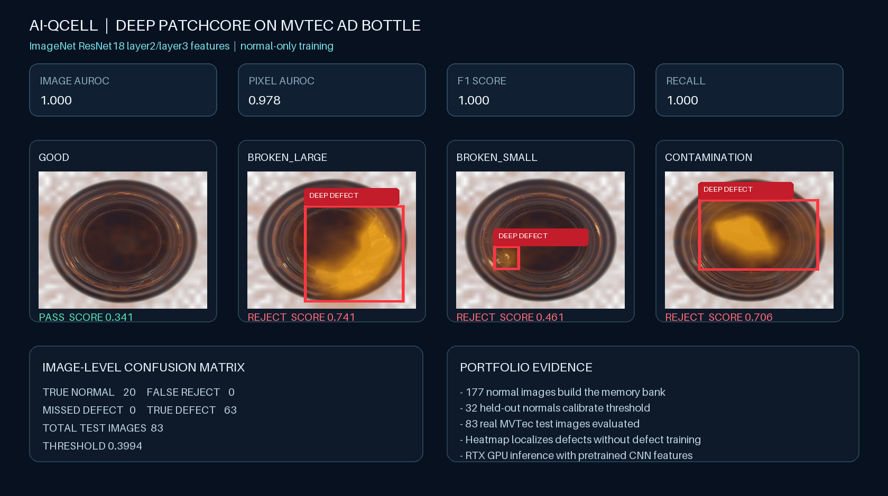
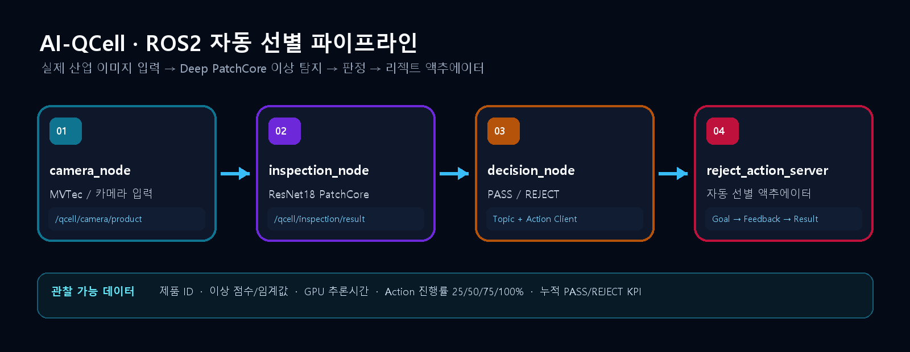
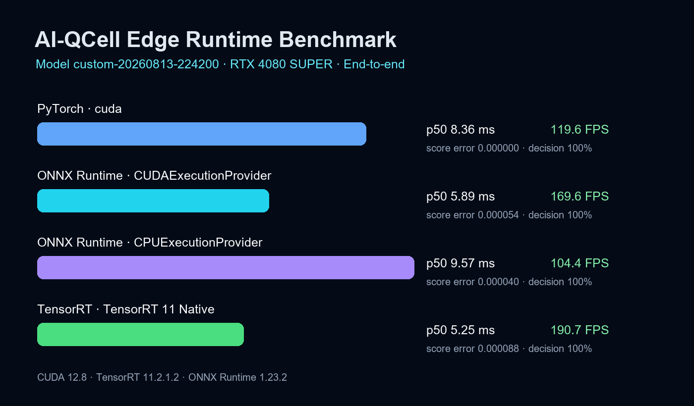

# AI-QCell

[](https://github.com/zeroziba9-hash/ai-qcell-physical-ai/actions/workflows/ci.yml)
[](https://github.com/zeroziba9-hash/ai-qcell-physical-ai/actions/workflows/ros2.yml)
[](https://github.com/zeroziba9-hash/ai-qcell-physical-ai/actions/workflows/docker.yml)
[](https://github.com/zeroziba9-hash/ai-qcell-physical-ai/actions/workflows/edge-runtime.yml)

[](docs/videos/ai_qcell_portfolio_demo.mp4)

Physical AI 기반 스마트팩토리 품질검사 셀 포트폴리오 프로젝트입니다.

AI-QCell은 가상 생산라인, 기준 이미지 비교, 정상 제품만 학습하는 경량 모델과 MVTec AD 실제 산업 이미지용 Deep PatchCore를 제공합니다. 결함 히트맵, REJECT 명령, 생산 KPI와 모델 평가 결과를 한 대시보드에서 확인할 수 있습니다.

## 시각화 결과



- 정상 기준 / 검사 대상 / AI 결함 히트맵 비교
- 불량 바운딩 박스와 REJECT 명령
- 이상 점수, 결함 면적, 추론시간 KPI
- 생산량, 불량률, 결함 유형 분포 대시보드

Streamlit 왼쪽 메뉴의 `vision inspection` 페이지에서 직접 조작할 수 있습니다.

## 학습 모델 평가



`PatchMemoryDetector`는 정상 제품 이미지 40장만 학습하고, 위치별 패치 특징을 최근접 정상 메모리와 비교합니다.

| 지표 | 합성 평가셋 결과 |
|---|---:|
| Accuracy | 98.21% |
| Precision | 97.30% |
| Recall | 100.00% |
| F1 | 98.63% |
| AUROC | 1.000 |

모델 재학습 및 평가:

```bash
python -m scripts.train_patch_memory
python -m scripts.evaluate_patch_memory
```

> 위 수치는 정렬된 합성 제품 56개에 대한 베이스라인 결과이며 MVTec AD 벤치마크 점수가 아닙니다.

## Deep PatchCore · 실제 MVTec AD



- ImageNet 사전학습 ResNet18 `layer2`/`layer3` 특징
- 정상 이미지 177장으로 메모리 뱅크 학습
- 정상 이미지 32장으로 판정 임계값 보정
- 실제 MVTec bottle 테스트 이미지 83장 평가
- 결함 이미지 없이 대형 파손, 소형 파손, 오염 탐지

| 지표 | MVTec bottle 결과 |
|---|---:|
| Image AUROC | 1.000 |
| Pixel AUROC | 0.9782 |
| Accuracy / F1 | 100.00% / 100.00% |
| 정상 / 결함 테스트 | 20 / 63 |

> MVTec AD 데이터는 CC BY-NC-SA 4.0이며 연구·교육용 포트폴리오 범위로 사용합니다.

## ROS2 자동 선별 파이프라인



Deep PatchCore의 판정을 실제 생산 셀 동작으로 연결하는 ROS2 패키지를 추가했습니다.

| 구성 요소 | 인터페이스 | 역할 |
|---|---|---|
| `camera_node` | `/qcell/camera/product` Topic | 제품 ID와 카메라 이미지 발행 |
| `inspection_node` | `/qcell/inspection/result` Topic | GPU Deep PatchCore 검사 결과 발행 |
| `decision_node` | Topic + Action Client | PASS 통과 또는 REJECT 목표 전송 |
| `reject_action_server` | `/qcell/reject_product` Action | 선별기 진행률 25/50/75/100% 피드백 |
| `dashboard_bridge` | Topic Subscriber | 검사·선별 이벤트와 KPI 연결 |

Streamlit의 `ROS2 Sorting Pipeline` 페이지는 같은 메시지·토픽·액션 계약을 재현하는 Mock Runtime으로
즉시 시연됩니다. 실제 ROS2 패키지는 [`ros2_ws`](ros2_ws/README.md)에 있으며 Ubuntu 24.04 WSL2의
ROS2 Jazzy에서 `colcon build`와 런타임 검증을 완료했습니다. CUDA Deep PatchCore 노드가 RTX 4080
SUPER에서 실제 anomaly score를 발행하고 Reject Action 결과까지 전달하는 것을 확인했습니다.

## 실시간 카메라·영상 검사

Streamlit의 `Realtime Inspection` 페이지에서 다음 입력을 지원합니다.

- 브라우저 WebRTC 웹캠 실시간 추론
- `st.camera_input` 카메라 스냅샷
- MP4/MOV/AVI/MKV 영상 업로드 및 히트맵 MP4 생성
- 불량 프레임 자동 저장과 검사 이력 CSV 다운로드
- 검사 프레임 수, REJECT 비율, 평균 GPU 지연시간 KPI

## 액추에이터 디지털 트윈

`Actuator Digital Twin` 페이지는 컨베이어 위 제품, 검사 카메라, 선별 게이트와 REJECT BIN을 7초 애니메이션으로
재현합니다. Deep PatchCore 판정과 ROS2 Action의 Goal → Feedback → Result 상태를 동일 제품 ID로 연결합니다.

## 배포와 품질 자동화

- `Dockerfile`과 `compose.yaml`: Streamlit 애플리케이션 컨테이너 실행
- `Python CI`: 전체 pytest 및 Python compile 검증
- `ROS2 Jazzy Build`: 인터페이스와 노드 패키지 colcon build
- `Docker Build`: CPU 추론용 프로덕션 이미지 빌드 검증
- 42초 MP4 포트폴리오 데모: [`docs/videos/ai_qcell_portfolio_demo.mp4`](docs/videos/ai_qcell_portfolio_demo.mp4)


## 실행

```bash
python -m venv .venv
.venv\Scripts\activate
pip install -r requirements.txt
pip install -r requirements-ml.txt --index-url https://download.pytorch.org/whl/cu128
pip install -r requirements-video.txt
python -m scripts.download_mvtec_bottle
python -m scripts.train_deep_patchcore
python -m scripts.evaluate_deep_patchcore
streamlit run app.py
```

## 사용자 데이터 능동학습

Streamlit의 `Dataset Studio` → `Training Lab` → `Model Registry` → `Review Queue`가 하나의 재학습 루프를 구성합니다.

- 카메라·업로드 이미지의 정상/불량/미확인 라벨링
- 정상 학습 데이터와 검증·테스트 데이터의 시드 기반 자동 분할
- Deep PatchCore 사용자 모델 재학습 및 라벨 검증 데이터 기반 임계값 자동 보정
- 모델별 F1, AUROC, Precision, Recall, Confusion Matrix, ROC 비교
- PRODUCTION 모델 배포와 이전 버전 롤백
- 실시간 REJECT 및 불확실 샘플의 작업자 검토와 Dataset Studio 재유입
- 배포 버전을 Deep PatchCore, ROS2, 실시간 검사, 디지털 트윈에서 공통 사용

데모 데이터 적재부터 학습·배포까지 한 번에 재현할 수 있습니다.

```powershell
python -m scripts.train_active_learning --seed-demo --deploy
```

## ONNX · TensorRT 엣지 최적화



PRODUCTION Deep PatchCore의 전처리, ResNet18 특징 추출, 메모리 뱅크 최근접 거리, anomaly map을 하나의 ONNX 그래프로 내보내고 TensorRT 네이티브 엔진으로 빌드합니다.

| Runtime | Provider | p50 | p95 | 처리량 | 판정 일치율 |
|---|---|---:|---:|---:|---:|
| PyTorch | CUDA | 8.36 ms | 9.30 ms | 119.63 FPS | 100% |
| ONNX Runtime | CUDA | 5.90 ms | 6.62 ms | 169.62 FPS | 100% |
| ONNX Runtime | CPU | 9.58 ms | 10.15 ms | 104.44 FPS | 100% |
| TensorRT 11 | Native CUDA | 5.25 ms | 5.61 ms | 190.65 FPS | 100% |

> RTX 4080 SUPER에서 이미지 준비, 추론, 히트맵 렌더링을 포함해 30회 측정한 포트폴리오 환경 결과입니다. TensorRT 엔진은 대상 GPU에서 다시 빌드해야 합니다.

```powershell
pip install -r requirements-edge.txt
pip install -r requirements-tensorrt.txt
python -m scripts.export_edge_model --build-tensorrt
python -m scripts.benchmark_edge_runtime --include-cpu
```

## Docker

```powershell
docker compose up --build
```

## ROS2 Jazzy on Ubuntu 24.04 WSL2

```powershell
wsl -d Ubuntu-24.04 -u root -- bash /mnt/c/Users/user/ai-qcell/scripts/install_ros2_wsl.sh
wsl -d Ubuntu-24.04 -- bash /mnt/c/Users/user/ai-qcell/scripts/install_ros2_deep_env.sh
powershell -ExecutionPolicy Bypass -File scripts/run_ros2_wsl.ps1 -Mode deep
```

## 테스트

```bash
pytest
```

## 로드맵

- Phase 1: 가상 생산라인과 품질 대시보드
- Phase 2: MVTec AD bottle + Deep PatchCore 완료
- Phase 3: ROS2 Topic/Action 자동 선별 파이프라인 완료
- Phase 4: 실시간 카메라·영상 검사 및 액추에이터 디지털 트윈 완료

